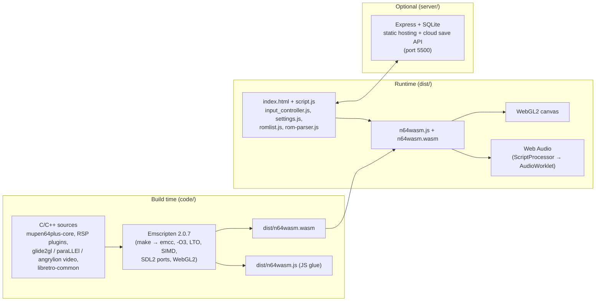

# n64-wasm

A Nintendo 64 emulator that runs entirely in the browser — the RetroArch ParaLLEl N64 core compiled to WebAssembly with Emscripten.

[](LICENSE)
[](https://webassembly.org/)
[](https://emscripten.org/)
[](https://www.khronos.org/webgl/)

## Overview

n64-wasm compiles the [ParaLLEl N64 libretro core](https://github.com/libretro/parallel-n64) (mupen64plus-core plus its RSP and video plugins) to WebAssembly and pairs it with a plain-JavaScript frontend. The emulator renders to a WebGL2 canvas, streams audio through the Web Audio API (upgrading from a `ScriptProcessorNode` to an `AudioWorklet` when the page is cross-origin isolated), and persists saves in the browser — with an optional self-hosted server for cloud save states.

Game compatibility is solid: a good portion of the 3D library is playable at full speed on a mid-range computer, and it also runs on mobile Safari and console browsers.

> **Attribution:** This repository is a fork of [N64Wasm](https://github.com/nbarkhina/N64Wasm) by **[Neil Barkhina](https://www.neilb.net/n64wasm/)**, who created the original port and wrote the vast majority of this codebase. The MIT license and copyright in [LICENSE](LICENSE) are his. Upstream live demo: <https://www.neilb.net/n64wasm/>.

### Features

- Gamepad support (Xbox and PS4 controllers tested), with multiple-controller and mouse support
- Button and keyboard remapping (gamepad wizard included)
- Save states and SRAM, persisted in the browser across sessions
- Import/export of save files (`settings.js`)
- Optional cloud save states via a self-hosted server (`server/`)
- Mobile touch controls
- Gameshark codes
- Zoom controls, full screen, dark mode
- Software renderer option (Angrylion) alongside the hardware-accelerated path

## Screenshots


## Architecture



## Getting Started

### Run the prebuilt emulator

The compiled `n64wasm.js` / `n64wasm.wasm` artifacts are checked in, so no toolchain is required — just serve `dist/` from any static web server (it will not work from `file://`):

```bash
cd dist
python3 -m http.server 8080
# then open http://localhost:8080
```

Load your own **legally obtained** ROM file (`.z64` / `.v64`) through the UI. This project does not include or distribute ROMs.

> Note: the AudioWorklet audio path activates only when the page is served with cross-origin isolation (COOP/COEP headers); otherwise the emulator falls back to `ScriptProcessorNode` automatically.

### Run with the cloud save server

The `server/` folder contains an Express + SQLite server (TypeScript source in `app.ts`, compiled `app.js`) that both hosts the frontend and stores save states server-side:

1. Inside `server/`, create `wwwroot/` and copy the contents of `dist/` into it.
2. Set `CLOUDSAVEURL: "api"` in `settings.js` and change `const PASSWORD = "mypassword";` in `app.js`.
3. `npm install && npm run start`, then open `http://localhost:5500` (port configurable via `PORT`).

Full instructions — including a Docker setup (`server/docker/`) and a PHP implementation contributed by [@kimboslice99](https://github.com/kimboslice99) (`server/php/`) — are in [server/README.md](server/README.md). To pre-populate a game dropdown for a private deployment, uncomment and edit `ROMLIST` in `dist/romlist.js`, pointing it at your own legally obtained ROMs.

### Rebuild the WebAssembly core

The core builds with **Emscripten 2.0.7** specifically (newer versions are untested here). Any Linux-like environment works (WSL included):

```bash
git clone https://github.com/emscripten-core/emsdk.git
cd emsdk
./emsdk install 2.0.7
./emsdk activate 2.0.7
source ./emsdk_env.sh

cd /path/to/n64-wasm/code
make
```

`make` compiles the C/C++ sources and moves the resulting `n64wasm.js` and `n64wasm.wasm` into `dist/`. Notable link flags (see `code/Makefile`): `-O3 -flto`, WASM SIMD (`-msimd128 -mrelaxed-simd`), SDL2/SDL2_ttf/SDL2_image/zlib via Emscripten ports, WebGL2 (`MIN_WEBGL_VERSION=2`, `FULL_ES3`), and a fixed 512 MB heap.

**Zero-setup option:** the repo ships a [dev container](.devcontainer/) (Ubuntu 22.04 + emsdk 2.0.7 preinstalled). Open it in GitHub Codespaces ("Code" → "Create codespace") and run `make`.

### Native Windows build (debugging)

Debugging inside WebAssembly is limited to print statements, so a native Windows build is provided for real breakpoint debugging via `code/N64_Wasm.vcxproj` (Visual Studio 2019):

- Edit the include/library paths in the `.vcxproj` to match your machine.
- Required libraries: SDL2 (2.0.14), SDL2_image (2.0.5), SDL2_ttf (2.0.15), GLEW (2.2.0). A GPU with OpenGL support is required.
- Point `mymain.cpp` at a legally obtained ROM in your working directory: `sprintf(rom_name, "%s", "game.z64");`
- Release mode runs significantly faster than Debug (but disables breakpoints).

## Project Structure

```
n64-wasm/
├── code/               # Emulator core + build system
│   ├── Makefile        # Emscripten build (emcc), outputs to dist/
│   ├── mymain.cpp      # Frontend entry point (SDL2)
│   ├── src/            # ParaLLEl N64 core: mupen64plus-core, RSP plugins
│   │                   # (hle, cxd4, paraLLEl), video plugins (glide2gl,
│   │                   # gles2n64, gles2rice, angrylion, paraLLEl),
│   │                   # libretro-common
│   └── N64_Wasm.vcxproj# Native Windows debug build (VS2019)
├── dist/               # Prebuilt web app (serve this directory)
│   ├── n64wasm.wasm    # Compiled emulator core
│   ├── n64wasm.js      # Emscripten JS glue
│   ├── index.html      # UI shell (canvas, menus, mobile controls)
│   ├── script.js       # Main frontend logic (audio, video, save states)
│   ├── settings.js     # Deployment configuration (cloud saves, UI toggles)
│   └── romlist.js      # Optional game dropdown for self-hosting
├── server/             # Optional Express + SQLite cloud save server
│   ├── app.ts / app.js # Server source (TypeScript) and compiled output
│   ├── docker/         # Docker deployment
│   └── php/            # PHP implementation (community-contributed)
├── screenshots/        # Images used in documentation
├── .devcontainer/      # Codespaces/devcontainer with emsdk 2.0.7
└── LICENSE             # MIT (c) 2021 Neil Barkhina
```

## Related Repositories

- [n64-web](https://github.com/wbaxterh/n64-web) — web frontend built around this emulator
- [n64-docs](https://github.com/wbaxterh/n64-docs) — documentation for the n64 project family

## References

- Upstream project: [nbarkhina/N64Wasm](https://github.com/nbarkhina/N64Wasm) by Neil Barkhina
- Emulator core: [libretro/parallel-n64](https://github.com/libretro/parallel-n64)

## License

MIT — see [LICENSE](LICENSE). Copyright (c) 2021 Neil Barkhina (upstream author of N64Wasm). Modifications in this fork are provided under the same license.
